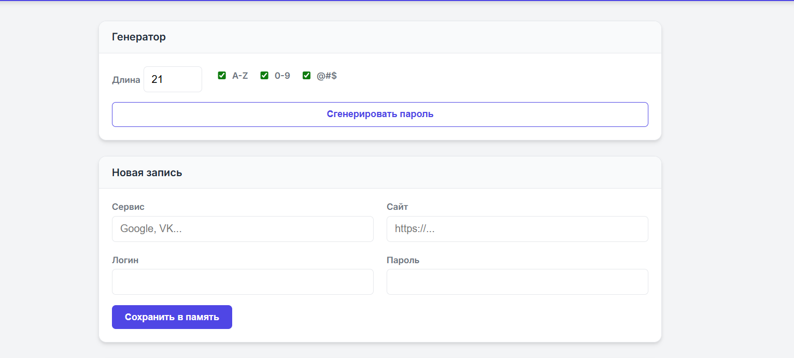
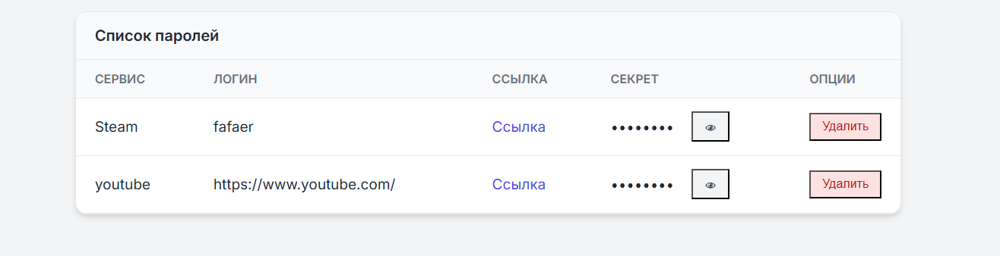
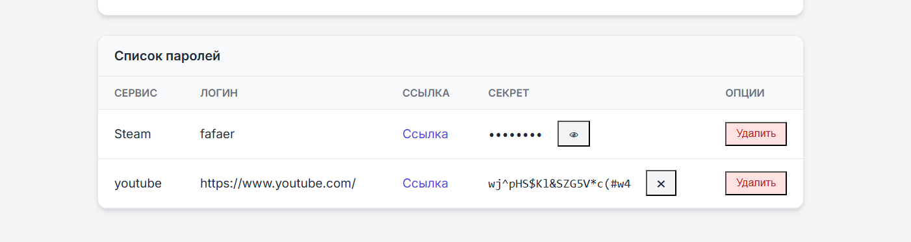
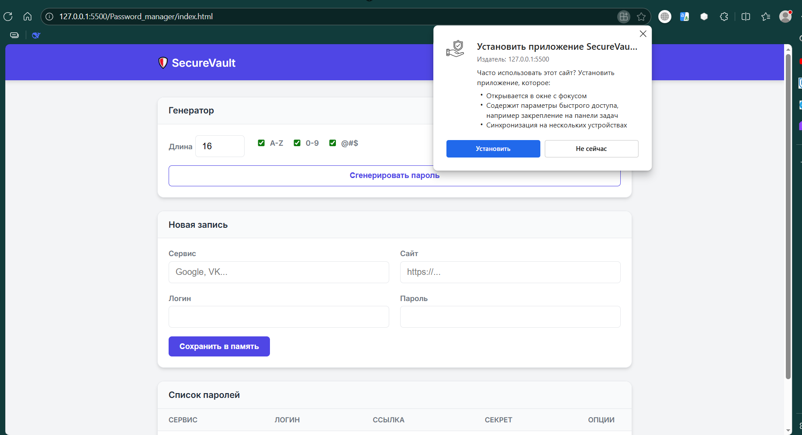
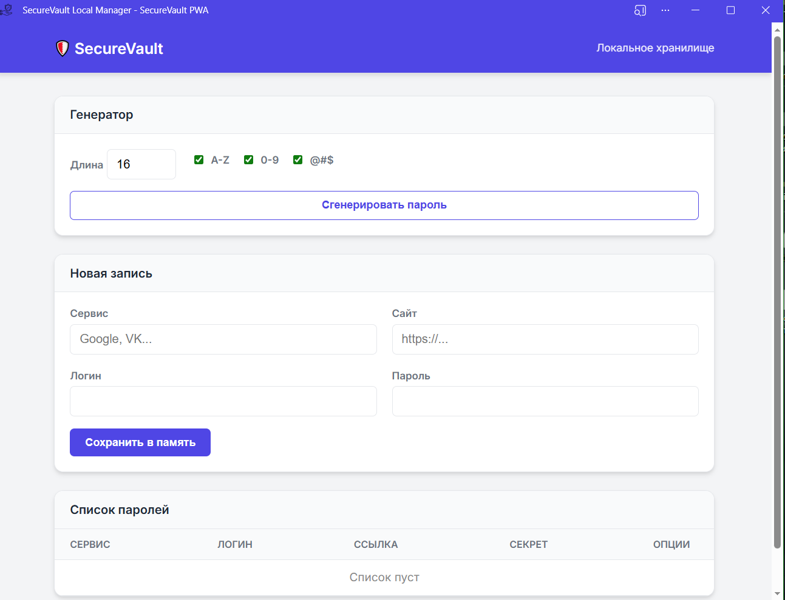
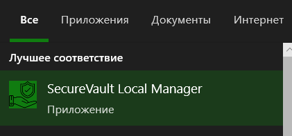
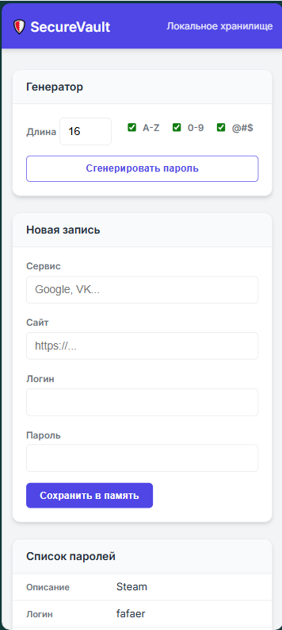

# Лабораторная работа менеджер паролей Леонов Даниил группа 932205

### 1. Генератор паролей
- Настройка длины пароля (от 4 до 64 символов).
- Выбор набора символов:
  - `A-Z` (Заглавные буквы);
  - `0-9` (Цифры);
  - `@#$` (Спецсимволы).

### 2. Менеджер записей
- Добавление сервисов с полями: Название, URL, Логин, Пароль.
- Хранение данных в зашифрованном виде (визуально скрыты).
- Возможность показать/скрыть пароль по клику.
- Удаление записей.

### 3. PWA возможности (Progressive Web App)
- **Установка:** Приложение можно установить на ПК или смартфон как нативную программу.
- **Офлайн-режим:** Полная работоспособность без интернета благодаря Service Worker.

---

## Скриншоты

### Главный интерфейс

### Установка приложения

### Интеграция в ОС

### Вид на телефоне 

