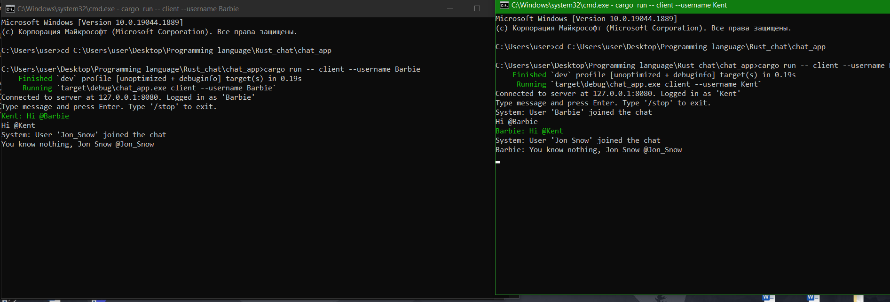
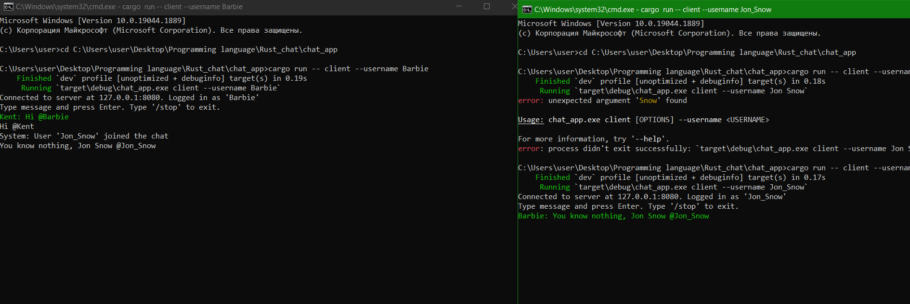
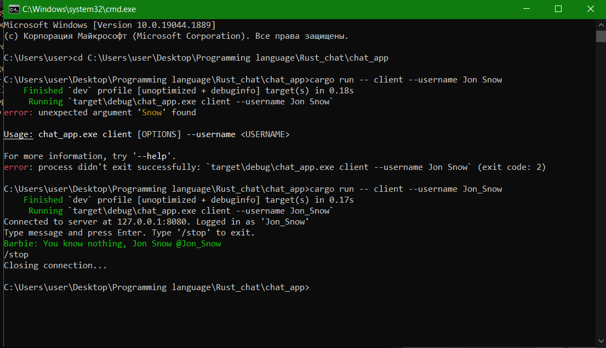
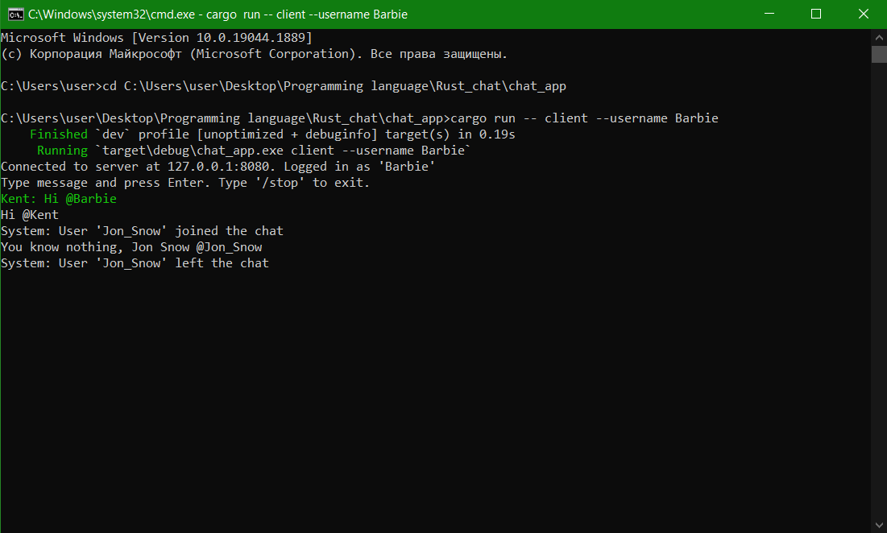
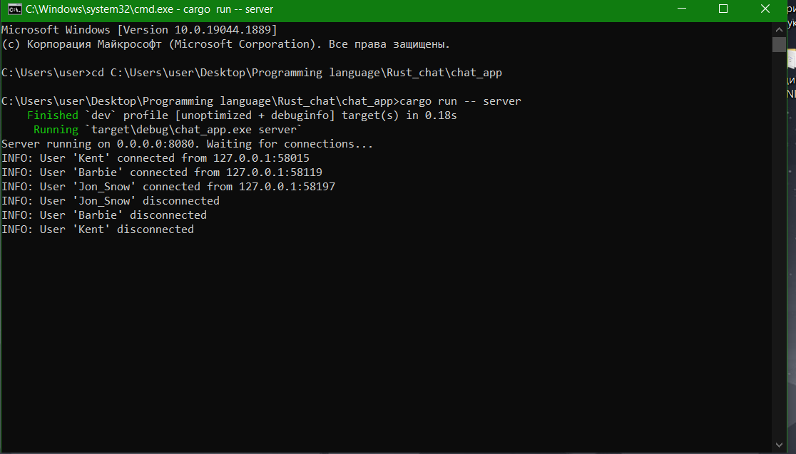

## 1. Указание ключей и параметров запуска

Приложение представляет собой единый бинарный файл, который может работать в режиме **Сервера** или **Клиента** в зависимости от переданной подкоманды.

### Запуск Сервера

Для запуска сервера используется подкоманда `server`.

**Параметры:**
*   `-p`, `--port <PORT>` — Указывает порт, на котором сервер будет принимать соединения.
    *   *По умолчанию:* `8080`.

**Примеры запуска:**

1.  **Запуск с настройками по умолчанию (порт 8080):**
    ```bash
    cargo run -- server
    ```

2.  **Запуск на другом порту (например, 9000):**
    ```bash
    cargo run -- server --port 9000
    ```

---

### Запуск Клиента

Для запуска клиента используется подкоманда `client`.

**Параметры:**
*   `-u`, `--username <USERNAME>` — **(Обязательно)** Имя пользователя, которое будет отображаться в чате.
*   `-a`, `--address <ADDRESS>` — Адрес сервера для подключения в формате `ip:port`.
    *   *По умолчанию:* `127.0.0.1:8080`.

**Примеры запуска:**

1.  **Подключение к локальному серверу (по умолчанию):**
    ```bash
    cargo run -- client --username Barbie
    ```

2.  **Подключение к другому порту:**
    ```bash
    cargo run -- client --username Kent --address 127.0.0.1:9000
    ```

---

## 2. Примеры работы чата

### 2.1. Запуск клиентов и демонстрация общения

Реализован функционал:
*   Отображение системных сообщений ("User joined the chat").
*   Обмен сообщениями в реальном времени.
*   **Подсветка упоминаний:** Когда пользователь хочет отправить сообщение другому он использует конструкцию @User и конечный получатель видет это сообщение с зеленой подсветкой.




### 2.2. Демонстрация команды выхода (/stop)

Для корректного завершения сеанса реализована команда `/stop`.
1.  Пользователь вводит `/stop`.
2.  Клиентское приложение выводит `Closing connection...` и завершает работу.
3.  Остальные участники чата получают уведомление `System: User "User" left the chat`.





### 2.3. Логи сервера

Сервер в реальном времени ведет лог событий в консоль.
Фиксируются следующие события:
*   `User connected`: Подключение нового сокета с указанием IP-адреса клиента и его имени.
*   `User disconnected`: Разрыв соединения (как принудительный, так и через команду `/stop`).


